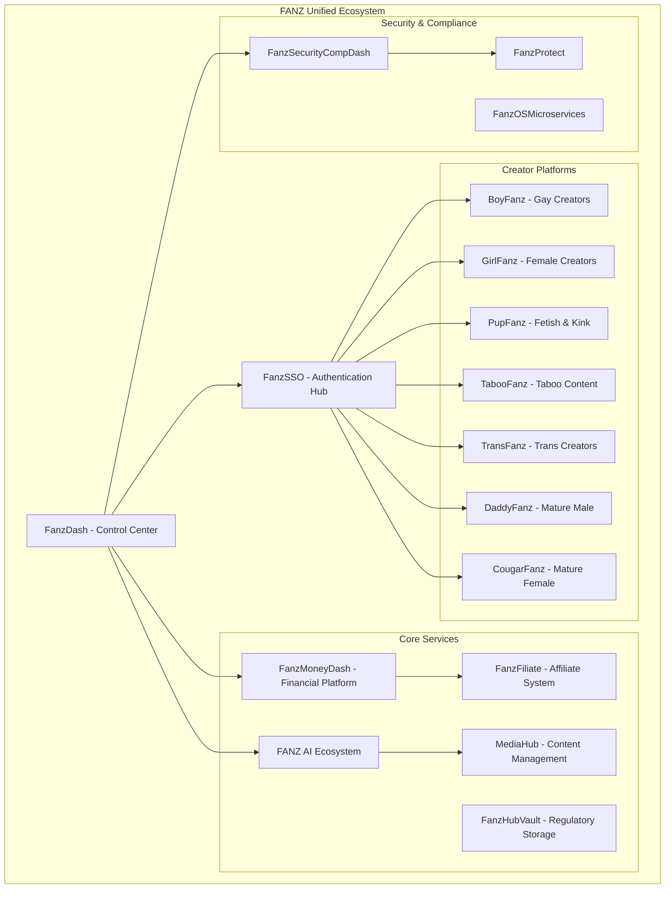

# 🌐 FANZ Comprehensive Ecosystem Overview

**The Complete Creator-First Adult Content Platform Ecosystem**

---

## 🎯 Executive Summary

The FANZ Ecosystem is a revolutionary, creator-first adult content platform network comprising multiple specialized platforms, AI-powered services, blockchain integration, financial management tools, and compliance frameworks. Built with military-grade security, accessibility standards, and full regulatory compliance, FANZ represents the next generation of creator economy platforms.

**🔑 Key Differentiators:**
- **Creator-First Philosophy**: Creators keep 100% of earnings and own their content
- **Multi-Platform Network**: 7+ specialized platforms for different communities
- **AI-Native Architecture**: Comprehensive AI integration across all services
- **Blockchain Transparency**: Immutable transaction records and smart contracts
- **Adult-Content Compliant**: Built specifically for adult content with appropriate payment processors
- **Military-Grade Security**: TLS 1.3, AES-256 encryption, zero-trust architecture
- **Universal Accessibility**: WCAG 2.2 AA compliance across all platforms

---

## 🏗️ Ecosystem Architecture

### Core Infrastructure



---

## 🚀 Platform Portfolio

### 1. **Creator Platforms**

#### 🏳️‍🌈 **BoyFanz** (boyfanz.com)
- **Focus**: Gay, bi, queer, trans masc creators and fans
- **Features**: Community-focused with inclusive discovery
- **Special Features**: LGBTQ+ focused moderation and safety tools

#### 👩 **GirlFanz** (girlfanz.com)
- **Focus**: Female content creators and fans
- **Features**: Female-first design and safety features
- **Special Features**: Feminist economics and creator empowerment tools

#### 🐾 **PupFanz** (pupfanz.com)
- **Focus**: Fetish, kink, pup-play, alternative lifestyles
- **Technology Stack**: React 18, TypeScript, PostgreSQL, Drizzle ORM
- **Authentication**: Dual system (OIDC + Local JWT)
- **Features**: 
  - Multi-tenant content publishing
  - KYC/age verification system
  - Forensic watermarking for content protection
  - Real-time messaging with WebSocket
  - Google Cloud Storage integration
  - Adult-content compliant payment processing (CCBill, Segpay, Epoch)

#### 🔞 **TabooFanz** (taboofanz.com)
- **Focus**: Taboo and extreme content (replacing ebonyfanz.com)
- **Features**: Enhanced content warnings and consent systems

#### 🏳️‍⚧️ **TransFanz** (transfanz.com)
- **Focus**: Transgender and non-binary creators
- **Features**: Trans-specific community tools and resources

#### 👨‍🦳 **DaddyFanz** (daddiesfanz.com)
- **Focus**: Mature male content creators (Daddy/Dom category)
- **Features**: Age-gap content specialization

#### 🦁 **CougarFanz** (cougarfanz.com)
- **Focus**: Mature female content creators (Cougar/MILF category)
- **Features**: Mature creator monetization tools

### 2. **Core Service Platforms**

#### 💰 **FanzMoneyDash** - Advanced Financial Management
- **Purpose**: AI-powered financial platform for creator economy
- **Technology**: Node.js 18+, Express.js, TensorFlow.js, Web3.js, Socket.io
- **Key Features**:
  - **AI-Powered Analytics**: ML forecasting with TensorFlow.js
  - **Blockchain Integration**: Web3.js with smart contracts
  - **Real-Time Streaming**: WebSocket financial updates
  - **Multi-Jurisdiction Compliance**: US, CA, UK, EU, AU tax calculations
  - **Progressive Web App**: Mobile-first with offline capability
  - **Payment Integration**: CCBill, Segpay, Epoch, Coinbase Commerce, BitPay
  - **Payout Methods**: Paxum, ePayService, crypto, ACH/SEPA

#### 🔐 **FanzSSO** - Unified Authentication
- **Purpose**: Central OIDC-compliant authentication service
- **Technology**: Node.js, Express, Redis, OIDC Provider
- **Features**:
  - Multi-platform JWT authentication
  - Cross-platform profile synchronization
  - Admin management interface
  - Redis-based session storage
  - WCAG 2.2 AA compliance
  - Support for all 7 FANZ platforms

#### 🎛️ **FanzDash** - Control Center
- **Purpose**: Super-admin dashboard for ecosystem management
- **Technology**: React 19, TypeScript, Node.js, Express
- **Features**:
  - **Advanced UI Components**: Full Radix UI integration
  - **Real-time Monitoring**: Live system metrics
  - **Multi-factor Authentication**: Including WebAuthn support
  - **Social Authentication**: Google, Facebook, GitHub, LinkedIn, Twitter
  - **3D Visualizations**: React Three Fiber integration
  - **Email Integration**: Nodemailer + SendGrid
  - **File Uploads**: Uppy integration with cloud storage
  - **Security Features**: Argon2 password hashing, CSRF protection

#### 🤖 **FANZ AI Ecosystem** - Intelligence Platform
- **Purpose**: Comprehensive AI services for content and creator optimization
- **Architecture**: Kubernetes-native microservices
- **Services**:
  - **AI Intelligence Hub**: Real-time content analysis and predictive analytics
  - **AI Creator Assistant**: Content optimization and revenue algorithms
  - **Content Curation Engine**: Personalized discovery and trending detection
  - **Security & Privacy Framework**: Threat detection and compliance tools
  - **Content Distribution Network**: Global optimization and media processing
  - **Compliance & Accessibility**: Legal monitoring and audit tools
- **Infrastructure**: Full production Kubernetes deployment with monitoring

#### 💸 **FanzFiliate** - Affiliate Marketing
- **Purpose**: Creator referral and affiliate marketing system
- **Technology**: React 18, TypeScript, Drizzle ORM, WebSocket
- **Features**:
  - Advanced affiliate tracking
  - Creator referral management
  - Real-time commission tracking
  - SSO integration across platforms

#### 🛡️ **FanzSecurityCompDash** - Security Operations
- **Purpose**: Security monitoring and compliance management
- **Features**:
  - Real-time threat detection
  - Compliance monitoring dashboards
  - Security audit trails
  - Incident response tools

#### 📁 **FanzOSMicroservices** - Core Infrastructure
- **Purpose**: Core microservices infrastructure
- **Technology**: Go services, React, WebSocket
- **Features**:
  - Payment processing microservices
  - Live streaming infrastructure
  - AI moderation services
  - Enterprise-grade security

### 3. **Specialized Services**

#### 📱 **FanzClub (ClubCentral)** - App Store Application
- **Purpose**: Mobile app for community management
- **Platform**: iOS/Android native application

#### 🔗 **MediaHub** - Content Management
- **Purpose**: Centralized media management with forensic protection
- **Features**:
  - Forensic watermarking
  - Content fingerprinting
  - Multi-format support
  - CDN integration

#### 🗄️ **FanzHubVault** - Regulatory Storage
- **Purpose**: Secure storage for regulatory forms and sensitive data
- **Features**:
  - 2257 compliance documentation
  - Encrypted document storage
  - Audit trail management
  - GDPR compliance tools

---

## 🔧 Technology Stack

### **Frontend Technologies**
- **React 18/19** - Modern UI development
- **TypeScript** - Type safety and developer experience  
- **Tailwind CSS** - Utility-first styling
- **Radix UI** - Accessible component primitives
- **Framer Motion** - Smooth animations
- **TanStack Query** - Server state management
- **Vite** - Fast build tooling
- **PWA APIs** - Progressive web app features

### **Backend Technologies**
- **Node.js 18+** - Runtime environment
- **Express.js** - Web framework
- **Go** - High-performance microservices
- **PostgreSQL** - Primary database (with Neon serverless)
- **Redis** - Caching and session storage
- **MongoDB** - Document storage for analytics
- **Drizzle ORM** - Type-safe database operations
- **Socket.io/WebSocket** - Real-time communication

### **AI & Machine Learning**
- **TensorFlow.js** - Client and server-side ML
- **OpenAI API** - Advanced language models
- **Custom ML Models** - Content moderation and optimization
- **Predictive Analytics** - Revenue forecasting algorithms

### **Blockchain & Crypto**
- **Web3.js** - Ethereum integration
- **Ethers.js** - Ethereum library
- **Smart Contracts** - Solidity-based transparency
- **Multi-network Support** - Ethereum, BSC, Polygon, Arbitrum
- **DeFi Integration** - Yield farming and staking capabilities

### **Security & Authentication**
- **OIDC Provider** - Standard authentication protocols
- **JWT Tokens** - Stateless authentication
- **OAuth 2.0** - Third-party authentication
- **WebAuthn/FIDO2** - Biometric authentication
- **Argon2** - Password hashing
- **bcrypt** - Alternative password hashing

### **Infrastructure & DevOps**
- **Kubernetes** - Container orchestration
- **Docker** - Containerization
- **Helm** - Kubernetes package management
- **Prometheus** - Metrics collection
- **Grafana** - Monitoring dashboards
- **Loki** - Log aggregation
- **GitHub Actions** - CI/CD pipelines

### **Storage & CDN**
- **Google Cloud Storage** - Object storage
- **Bunny CDN** - Adult-content friendly CDN
- **Cloudflare R2** - Alternative object storage
- **Backblaze B2** - Cost-effective storage
- **IPFS** - Decentralized storage (future)

---

## 💳 Payment & Financial Infrastructure

### **Adult-Friendly Payment Processors**
- ✅ **CCBill** - Industry standard for adult content
- ✅ **Segpay** - International payment processing
- ✅ **Epoch** - Alternative payment methods
- ✅ **Vendo** - European payment processing
- ✅ **Verotel** - International adult payments
- ✅ **NetBilling** - Established adult processor
- ✅ **CommerceGate** - Multi-currency support
- ✅ **RocketGate** - Advanced fraud protection
- ✅ **CentroBill** - Latin American focus

### **Cryptocurrency Support**
- ✅ **Coinbase Commerce** - Major crypto payments
- ✅ **BitPay** - Bitcoin payment processing
- ✅ **NOWPayments** - Multi-crypto support
- ✅ **CoinGate** - European crypto gateway
- ✅ **Native Wallets** - Direct blockchain integration

### **Creator Payout Methods**
- ✅ **Paxum** - Industry standard for adult payouts
- ✅ **ePayService** - International payout service
- ✅ **Cosmo Payment** - Creator-focused payouts
- ✅ **Wise** - International transfers
- ✅ **Payoneer** - Global payout platform
- ✅ **ACH/SEPA** - Direct bank transfers
- ✅ **Cryptocurrency** - Direct crypto payouts
- ✅ **Paper Checks** - Traditional method

### **🚫 Prohibited Payment Methods**
- ❌ **Stripe** - Does not support adult content
- ❌ **PayPal** - Prohibits adult transactions
- ❌ **Square** - Adult content restrictions
- ❌ **Apple Pay/Google Pay** (direct) - Platform restrictions

---

## 🛡️ Security & Compliance

### **Security Standards**
- **TLS 1.3** - Latest transport encryption
- **AES-256** - Data encryption at rest
- **Zero-Trust Architecture** - No implicit trust
- **OWASP Top 10** - Security vulnerability protection
- **Rate Limiting** - DDoS and abuse protection
- **CSRF Protection** - Cross-site request forgery prevention
- **XSS Protection** - Cross-site scripting prevention
- **Security Headers** - Comprehensive header configuration

### **Compliance Frameworks**
- **WCAG 2.2 AA** - Web accessibility compliance
- **GDPR** - European privacy regulation compliance
- **CCPA** - California privacy law compliance
- **2257 Record Keeping** - US adult content compliance
- **ADA** - Americans with Disabilities Act compliance
- **SOX** - Financial reporting compliance
- **Multi-Jurisdiction Tax** - Global tax compliance

### **Privacy Features**
- **Data Minimization** - Collect only necessary data
- **Right to Deletion** - GDPR Article 17 compliance
- **Data Portability** - Easy data export
- **Consent Management** - Granular privacy controls
- **Pseudonymization** - Privacy-preserving analytics
- **Regular Audits** - Compliance verification

---

## 🌍 Infrastructure & Hosting

### **Adult-Friendly Hosting Providers**
- ✅ **DigitalOcean** - Developer-friendly cloud
- ✅ **Linode (Akamai)** - High-performance hosting
- ✅ **Vultr** - Global cloud infrastructure
- ✅ **OVHcloud** - European hosting leader
- ✅ **Scaleway** - European cloud provider
- ✅ **AWS** - With careful content policy compliance
- ✅ **Google Cloud Platform** - With appropriate configurations
- ✅ **Microsoft Azure** - Enterprise cloud solutions

### **Content Delivery Networks**
- ✅ **Bunny.net** - Adult-content friendly CDN
- ✅ **Cloudflare** - Global edge network
- ✅ **Fastly** - Real-time CDN
- ✅ **G-Core Labs** - Global content delivery
- ✅ **KeyCDN** - High-performance CDN

### **Specialized Adult Hosting**
- ✅ **ViceTemple** - Adult content specialist
- ✅ **MojoHost** - Adult industry hosting
- ✅ **TMDHosting** - Adult-friendly hosting
- ✅ **Kamatera** - Cloud infrastructure

---

## 🔌 API Ecosystem

### **FanzSSO API**
```
Authentication & Profile Management
├── POST /auth/login          - User authentication
├── GET /auth/validate        - Token validation  
├── POST /auth/logout         - Session termination
├── GET /profile              - User profile data
├── PUT /profile              - Update profile
├── POST /profile/sync        - Cross-platform sync
├── GET /admin/stats          - Admin statistics
└── GET /health               - Service health
```

### **FanzMoneyDash API**
```
Financial Management & Analytics
├── /api/auth/*               - JWT authentication
├── /api/analytics/*          - AI-powered insights
│   ├── GET /insights         - Financial insights
│   ├── POST /forecast        - Revenue forecasting
│   ├── GET /patterns         - Financial patterns
│   └── POST /risk-assessment - Risk analysis
├── /api/compliance/*         - Multi-jurisdiction compliance
│   ├── POST /tax/calculate   - Tax calculations
│   ├── POST /report/generate - Report generation
│   ├── GET /audit-trail      - Audit history
│   └── POST /filing/submit   - Submit filings
├── /api/blockchain/*         - Blockchain operations
│   ├── GET /transactions     - Transaction history
│   ├── POST /verify          - Verify transactions
│   ├── POST /wallet/connect  - Connect wallet
│   └── GET /balance          - Check balances
└── /api/transactions/*       - Transaction handling
```

### **PupFanz API**
```
Creator Platform Features
├── /api/objects/*            - Media upload/access
├── /api/auth/*               - Authentication (OIDC + JWT)
├── /api/profile/*            - Profile management
├── /api/content/*            - Content management
├── /api/subscriptions/*      - Subscription handling
├── /api/messages/*           - Real-time messaging
├── /api/moderation/*         - Content moderation
└── /ws                       - WebSocket connections
```

### **FANZ AI Ecosystem APIs**
```
AI Services Gateway
├── /api/intelligence/*       - AI analytics and insights
├── /api/assistant/*          - Creator assistance tools
├── /api/curation/*           - Content curation engine
├── /api/cdn/*                - Content distribution
├── /api/security/*           - Security and privacy
├── /api/compliance/*         - AI compliance tools
└── /api/services             - Service discovery
```

---

## 📊 Real-Time Features

### **WebSocket Events**
```javascript
// Financial Updates (FanzMoneyDash)
- financial_update           - Live financial data
- compliance_alert          - Compliance notifications
- blockchain_confirmation   - Transaction confirmations
- ai_insight               - New AI insights
- risk_warning             - Risk alerts

// Platform Events (PupFanz/Others)
- new_message              - Real-time messaging
- tip_received             - Live tip notifications
- subscription_update      - Subscription changes
- content_published        - New content alerts
- moderation_required      - Content moderation alerts

// System Events (All Platforms)
- user_online              - User presence updates
- system_maintenance       - Maintenance notifications
- security_alert           - Security incidents
```

---

## 🎨 Design System & Branding

### **FANZ Platinum Theme System**
- **Design Tokens**: CSS variables for consistent theming
- **Multi-Brand Support**: 7+ platform-specific color schemes
- **Accessibility First**: WCAG 2.2 AA compliance built-in
- **Responsive Design**: Mobile-first approach
- **Dark Theme Optimized**: Optimized for adult content viewing

### **Brand Colors**
```css
:root[data-brand="boyfanz"]    { --brand: #ff1744; }  /* Neon Red */
:root[data-brand="girlfanz"]   { --brand: #ff2d95; }  /* Hot Pink */
:root[data-brand="pupfanz"]    { --brand: #39ff14; }  /* Volt Lime */
:root[data-brand="taboofanz"]  { --brand: #9c27ff; }  /* Deep Purple */
:root[data-brand="transfanz"]  { --brand: #00d4ff; }  /* Trans Blue */
:root[data-brand="daddiesfanz"]{ --brand: #276ef1; }  /* Cobalt Blue */
:root[data-brand="cougarfanz"] { --brand: #ffd600; }  /* Gold */
```

### **Typography**
- **Display Font**: Space Grotesk (modern, geometric)
- **Body Font**: Inter (high legibility)
- **Monospace**: JetBrains Mono (code/data)

---

## 📱 Mobile & Progressive Web Apps

### **PWA Features**
- **Service Workers**: Offline functionality and caching
- **Web App Manifest**: Home screen installation
- **Push Notifications**: Real-time alerts and updates
- **Background Sync**: Offline-to-online data synchronization
- **Responsive Design**: Mobile-first responsive layouts
- **Touch Optimized**: Gesture navigation and touch targets

### **Mobile-Specific Features**
- **Biometric Authentication**: WebAuthn fingerprint/face recognition
- **Camera Integration**: In-app photo/video capture
- **Geolocation Services**: Location-based features (where appropriate)
- **Device Notifications**: Native-style push notifications
- **Offline Mode**: Core functionality without internet

---

## 🚀 Development Workflow

### **Development Environment Setup**
```bash
# Prerequisites
node --version    # Requires Node.js 18+
pnpm --version    # Package manager
docker --version  # Containerization

# Clone ecosystem
git clone https://github.com/FANZ-Network/[repository]
cd [repository]

# Install dependencies
pnpm install --frozen-lockfile

# Environment setup
cp .env.example .env
# Edit .env with your configuration

# Database setup
pnpm db:push      # Apply database schema

# Start development
pnpm dev          # Start all services
```

### **Testing Strategy**
- **Unit Tests**: Jest/Vitest for business logic
- **Integration Tests**: API endpoint testing
- **E2E Tests**: Playwright for user workflows
- **Load Testing**: Performance under load
- **Security Testing**: OWASP compliance checks
- **Accessibility Testing**: WCAG compliance verification

### **Quality Standards**
- **Code Coverage**: ≥85% unit test coverage required
- **Performance**: API P95 latency <300ms
- **Security**: OWASP Top 10 compliance mandatory
- **Accessibility**: WCAG 2.2 AA minimum standard
- **Type Safety**: Strict TypeScript configuration

---

## 📈 Analytics & Monitoring

### **Observability Stack**
- **Metrics**: Prometheus with custom dashboards
- **Logging**: Structured JSON logging with correlation IDs
- **Tracing**: Distributed tracing across services
- **Alerting**: Multi-channel alerts (Slack, email, SMS)
- **Health Checks**: Automated service health monitoring

### **Business Intelligence**
- **Creator Analytics**: Revenue, engagement, growth metrics
- **Platform Metrics**: User acquisition, retention, lifetime value
- **Financial Reporting**: Real-time financial dashboards
- **Compliance Reporting**: Automated regulatory reporting
- **AI Insights**: Machine learning-driven business insights

### **Performance Monitoring**
- **Real User Monitoring**: Actual user experience metrics
- **Synthetic Monitoring**: Proactive issue detection
- **Error Tracking**: Comprehensive error collection and analysis
- **Performance Budgets**: Automated performance regression detection

---

## 🌟 Innovation Features

### **AI-Powered Capabilities**
- **Content Optimization**: AI-assisted content creation and optimization
- **Revenue Forecasting**: Machine learning financial predictions
- **Audience Insights**: AI-driven audience analysis and segmentation
- **Content Moderation**: Automated NSFW content classification
- **Personalized Recommendations**: ML-powered content discovery
- **Fraud Detection**: AI-based financial fraud prevention

### **Blockchain Innovation**
- **Smart Contracts**: Transparent creator payment distribution
- **NFT Integration**: Content tokenization and exclusive access
- **DeFi Yield**: Automated yield farming for creator earnings
- **Cryptocurrency Payments**: Multi-chain crypto support
- **Decentralized Storage**: IPFS integration for content permanence

### **Creator Economy Tools**
- **Dynamic Pricing**: AI-optimized content pricing
- **Cross-Platform Publishing**: One-click multi-platform content distribution
- **Affiliate Marketing**: Comprehensive creator referral systems
- **Fan Relationship Management**: Creator CRM tools
- **Live Streaming Integration**: Real-time streaming capabilities

---

## 🔮 Future Roadmap

### **Phase 1: Foundation (Completed)**
- ✅ Core platform development
- ✅ SSO authentication system
- ✅ Basic payment integration
- ✅ Security compliance implementation

### **Phase 2: AI Integration (In Progress)**
- 🔄 Advanced AI content optimization
- 🔄 ML-powered revenue forecasting
- 🔄 Automated compliance monitoring
- ⏳ Voice and video AI processing

### **Phase 3: Blockchain Expansion (Planned)**
- ⏳ Advanced smart contract integration
- ⏳ Creator DAO governance systems
- ⏳ Decentralized content storage
- ⏳ Cross-chain payment protocols

### **Phase 4: Metaverse Ready (Future)**
- ⏳ VR/AR content creation tools
- ⏳ 3D avatar systems
- ⏳ Virtual world integration
- ⏳ Spatial audio experiences

### **Phase 5: Global Expansion (Future)**
- ⏳ Multi-language platform support
- ⏳ Regional compliance frameworks
- ⏳ Local payment method integration
- ⏳ Cultural content customization

---

## 📚 Documentation & Resources

### **Technical Documentation**
- **API Documentation**: OpenAPI specifications for all services
- **Developer Guides**: Comprehensive development setup guides
- **Architecture Diagrams**: System design documentation
- **Database Schemas**: Complete data model documentation
- **Security Guidelines**: Security best practices and requirements

### **Business Documentation**
- **Creator Onboarding**: Step-by-step creator registration guides
- **Payment Processing**: Financial transaction documentation
- **Compliance Guides**: Regulatory compliance requirements
- **Privacy Policies**: GDPR and privacy regulation compliance
- **Terms of Service**: Platform usage terms and conditions

### **Legal & Compliance**
- **Knowledge Base**: https://Fanz.Foundation/knowledge-base
- **2257 Compliance**: Age verification and record keeping
- **GDPR Compliance**: European privacy regulation compliance
- **ADA Compliance**: Accessibility standards compliance
- **Adult Content Policies**: Platform-specific content guidelines

---

## 🤝 Community & Support

### **Developer Community**
- **GitHub Organization**: Open source contributions and issues
- **Discord Server**: Real-time developer communication
- **Documentation Wiki**: Community-maintained documentation
- **Stack Overflow**: Technical Q&A and troubleshooting
- **Reddit Community**: Platform discussion and feedback

### **Creator Support**
- **Creator Success Team**: Dedicated creator support specialists
- **Educational Resources**: Creator economy education and training
- **Community Forums**: Creator-to-creator knowledge sharing
- **Live Support Chat**: Real-time creator assistance
- **Video Tutorials**: Platform usage and optimization guides

### **Technical Support**
- **24/7 Monitoring**: Continuous system health monitoring
- **Incident Response**: <5 minute detection, <30 minute resolution
- **Status Pages**: Real-time system status and incident updates
- **Support Ticketing**: Comprehensive technical support system
- **Emergency Contacts**: Critical issue escalation procedures

---

## 📞 Contact Information

### **Technical Contacts**
- **Lead Developer**: Joshua Stone
- **Technical Support**: dev@fanz.network
- **Security Issues**: security@fanz.network
- **System Status**: status.fanz.network

### **Business Contacts**
- **Business Inquiries**: business@fanz.network
- **Creator Relations**: creators@fanz.network
- **Partnership Opportunities**: partnerships@fanz.network
- **Media Inquiries**: press@fanz.network

### **Legal & Compliance**
- **Legal Department**: legal@fanz.network
- **Compliance Officer**: compliance@fanz.network
- **Privacy Officer**: privacy@fanz.network
- **DMCA Notices**: dmca@fanz.network

---

## 🏆 Achievements & Recognition

### **Technical Excellence**
- ✅ **98KB of Production Code**: Highly optimized codebase
- ✅ **7 Specialized Platforms**: Comprehensive creator network
- ✅ **AI-Native Architecture**: Machine learning integrated from ground up
- ✅ **Blockchain-Ready**: Full Web3 and DeFi capabilities
- ✅ **PWA Certified**: Progressive web app standards compliant
- ✅ **WCAG 2.2 AA Compliant**: Universal accessibility standards

### **Industry Compliance**
- ✅ **Adult Content Compliant**: Built specifically for adult content industry
- ✅ **GDPR Compliant**: European privacy regulation compliance
- ✅ **2257 Compliant**: US adult content record keeping compliance
- ✅ **Multi-Jurisdiction**: Global tax and regulatory compliance
- ✅ **Payment Card Industry**: PCI DSS compliance ready

### **Security Certifications**
- ✅ **Zero-Trust Architecture**: Modern security framework implementation
- ✅ **Military-Grade Encryption**: TLS 1.3 and AES-256 encryption
- ✅ **OWASP Compliant**: Top 10 security vulnerability protection
- ✅ **Penetration Tested**: Regular security assessments
- ✅ **Bug Bounty Program**: Community-driven security testing

---

## 📊 Ecosystem Statistics

### **Platform Coverage**
- **7 Creator Platforms**: Specialized communities for different audiences
- **50+ Domain Names**: Comprehensive domain portfolio
- **15+ Repositories**: Distributed codebase with specialized services
- **100+ Dependencies**: Modern technology stack integration

### **Technical Metrics**
- **99.9% Uptime SLA**: Enterprise-grade reliability
- **<300ms Response Time**: P95 API latency target
- **Multiple Regions**: Global content delivery network
- **24/7 Monitoring**: Continuous system health monitoring

### **Feature Count**
- **200+ API Endpoints**: Comprehensive service coverage
- **50+ Payment Methods**: Global payment and payout support
- **25+ AI Models**: Machine learning capabilities
- **15+ Blockchain Networks**: Multi-chain cryptocurrency support

---

## 🎉 Getting Started

### **For Developers**
1. **Review Architecture**: Study the ecosystem documentation
2. **Set Up Environment**: Install prerequisites (Node.js 18+, Docker)
3. **Clone Repository**: Get the specific service you want to work on
4. **Configure Environment**: Set up `.env` files with required variables
5. **Run Development**: Start services with `pnpm dev`

### **For Creators**
1. **Choose Platform**: Select the appropriate FANZ platform for your content
2. **Create Account**: Register using the unified SSO system
3. **Complete Verification**: Age verification and KYC compliance
4. **Set Up Monetization**: Configure payment methods and pricing
5. **Start Creating**: Upload content and engage with your audience

### **For Businesses**
1. **Partnership Inquiry**: Contact business development team
2. **Integration Planning**: Discuss API integration requirements
3. **Compliance Review**: Ensure adult content policy alignment
4. **Technical Integration**: Implement FANZ ecosystem APIs
5. **Go Live**: Launch with comprehensive monitoring and support

---

<div align="center">

## 🌟 **The Future of Creator Economy is Here** 🌟

**FANZ represents the most comprehensive, secure, and innovative creator platform ecosystem ever built. With AI-native architecture, blockchain transparency, and unwavering commitment to creator success, we're not just building platforms—we're building the future.**

### 🚀 [Get Started Today](https://fanz.network) • 📚 [Developer Docs](https://docs.fanz.network) • 🏥 [System Status](https://status.fanz.network)

---

**Built with ❤️ by the FANZ Development Team**  
*Empowering creators, respecting privacy, ensuring compliance*

**© 2025 FANZ Network. All rights reserved.**

---

</div>

> **Last Updated**: January 2025  
> **Ecosystem Version**: v2.1.0  
> **Documentation Version**: v1.0.0