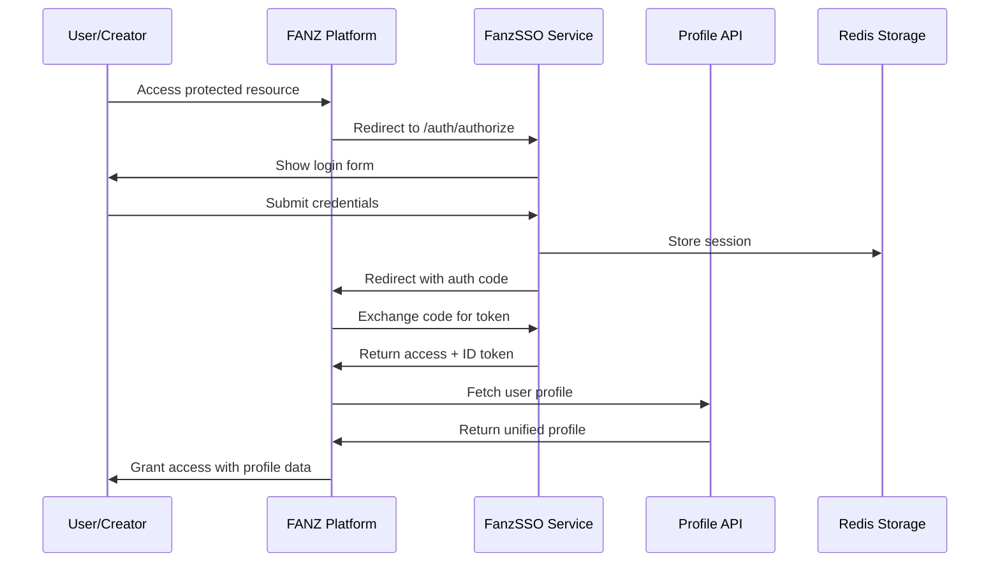

# FANZ Unified Ecosystem Architecture

## Overview

The FANZ Unified Ecosystem is a comprehensive creator-first adult content platform cluster that provides seamless Single Sign-On (SSO) authentication, unified user profiles, and shared services across multiple specialized platforms.

## Architecture Components

### 🔐 Core Authentication (FanzSSO)

**Location**: `/Users/joshuastone/Development/FANZ/FanzSSO`
**Purpose**: Central OIDC-compliant authentication service
**Technology**: Node.js + Express + Redis + OIDC Provider

#### Key Features:
- **Multi-platform OIDC provider** supporting all FANZ platforms
- **JWT token-based authentication** with refresh token support
- **Cross-platform profile synchronization**
- **Admin management interface**
- **Redis-based session storage**
- **WCAG 2.2 AA compliance**

#### Supported Platforms:
- BoyFanz (gay content creators)
- GirlFanz (female content creators)
- PupFanz (fetish & kink community)
- TabooFanz (taboo content creators)
- TransFanz (transgender content creators)
- DaddyFanz (mature male content creators)
- CougarFanz (mature female content creators)
- FanzDash (admin control center)

### 🏗️ Platform Architecture

#### **FANZ-Enterprise-Architecture**
**Location**: `/Users/joshuastone/Documents/GitHub/FANZ-Enterprise-Architecture`
**Purpose**: Core architectural blueprints and system design
**Integration**: SSO client configuration + shared design patterns

#### **FanzFiliate**
**Location**: `/Users/joshuastone/Documents/GitHub/FanzFiliate`
**Purpose**: Affiliate marketing and referral system
**Integration**: SSO authentication + creator referral tracking

#### **FanzSecurityCompDash**
**Location**: `/Users/joshuastone/Documents/GitHub/FanzSecurityCompDash`
**Purpose**: Security monitoring and compliance dashboard
**Integration**: SSO admin authentication + security audit trails

#### **FanzOSMicroservices**
**Location**: `/Users/joshuastone/Documents/GitHub/FanzOSMicroservices`
**Purpose**: Core microservices infrastructure
**Integration**: SSO service mesh authentication

#### **FanzMoneyDash**
**Location**: `/Users/joshuastone/Development/FANZ/FanzMoneyDash`
**Purpose**: Financial analytics and money management dashboard
**Integration**: SSO creator authentication + financial data sync

## 🔗 SSO Integration Architecture

### Authentication Flow



### Cross-Platform Profile Sharing

All FANZ platforms share a unified user profile through the SSO service:

#### Profile Structure
```typescript
interface FanzUser {
  id: string;
  email: string;
  username: string;
  verified: boolean;
  age_verified: boolean;
  roles: ('fan' | 'creator' | 'moderator' | 'admin')[];
  platforms: string[];
  preferences: {
    pronouns?: string;
    content_preferences?: string[];
    privacy_level: 'public' | 'private' | 'selective';
  };
  compliance: {
    kyc_verified: boolean;
    age_verification_date?: string;
    document_status: '2257_compliant' | 'pending' | 'not_required';
  };
}
```

### Platform-Specific Integration

Each platform includes standardized SSO integration:

1. **SSO Configuration** (`src/config/sso.ts`)
   - Platform-specific client credentials
   - Allowed domains and scopes
   - Adult content compliance settings

2. **Authentication Middleware** (`src/middleware/auth.ts`)
   - Token validation
   - Profile fetching
   - Platform access control

3. **Compliance Framework** (`docs/compliance/`)
   - GDPR compliance documentation
   - 2257 record keeping requirements
   - Age verification procedures
   - Security best practices

## 🛡️ Security & Compliance

### Security Features
- **TLS 1.3** encryption for all communication
- **AES-256** encryption for stored data
- **JWT tokens** with secure signing
- **CORS protection** with allowed origins
- **Rate limiting** and request validation
- **Secret scanning** in CI/CD pipelines

### Compliance Standards
- **WCAG 2.2 AA** accessibility compliance
- **GDPR** privacy regulations
- **2257 Record Keeping** compliance for adult content
- **ADA** compliance standards
- **Adult content hosting** requirements

### Infrastructure Requirements
- **Adult-friendly hosting providers**:
  - DigitalOcean, Linode, Vultr, OVH, Scaleway
  - Bunny.net, Cloudflare, G-Core Labs (CDN)
  - Backblaze B2, Cloudflare R2 (storage)
- **Payment processors** (adult-friendly only):
  - CCBill, Segpay, Epoch, Vendo, Paxum
  - Crypto payments (Bitcoin, USDT, etc.)
  - **NO Stripe or PayPal** (per compliance rules)

## 🚀 Development Workflow

### Repository Structure
```
FANZ Ecosystem/
├── Core Services/
│   └── FanzSSO/                    # SSO authentication service
├── Platform Services/
│   ├── FANZ-Enterprise-Architecture/
│   ├── FanzFiliate/
│   ├── FanzSecurityCompDash/
│   └── FanzOSMicroservices/
└── Management/
    └── FanzMoneyDash/              # This repository
```

### Standardized Toolchain
Each repository includes:
- **Docker & Docker Compose** for containerization
- **GitHub Actions** CI/CD pipelines
- **Security scanning** with secret detection
- **Code quality** checks (ESLint, Prettier)
- **Environment configuration** with `.env.example`
- **Documentation** with compliance guides

### Git Workflow
- **Main branch** protection with required reviews
- **Feature branches** (`feature/description`)
- **Automated testing** on all pull requests
- **Security scanning** before merge
- **Automated deployment** to staging/production

## 🌐 Platform Network

### Domain Architecture
Each platform uses dedicated domains from the approved list:

**Primary Platforms:**
- `boyfanz.com` - Gay content creators
- `girlfanz.com` - Female content creators  
- `pupfanz.com` - Fetish & kink community
- `taboofanz.com` - Taboo content creators
- `transfanz.com` - Transgender creators
- `daddiesfanz.com` - Mature male creators
- `cougarfanz.com` - Mature female creators

**Support Domains:**
- `fanz.foundation` - Legal & compliance center
- `fanz.fans` - Community hub
- `fanz.tube` - Video content platform

### API Endpoints

#### FanzSSO Service
- `GET /health` - Service health check
- `POST /auth/login` - User authentication
- `GET /auth/validate` - Token validation
- `GET /profile` - User profile data
- `PUT /profile` - Update profile
- `POST /profile/sync` - Cross-platform sync
- `GET /admin/stats` - Admin statistics
- `GET /admin/users` - User management

#### Platform Integration
All platforms implement:
- `GET /auth/callback` - SSO callback handling
- `POST /auth/logout` - SSO logout
- `GET /api/profile` - Local profile cache
- `PUT /api/profile` - Profile updates

## 🔄 Data Synchronization

### Profile Synchronization
- **Real-time sync** across platforms when profile updated
- **Eventual consistency** model for non-critical data
- **Conflict resolution** with last-write-wins strategy
- **Audit trail** for all profile changes

### Session Management
- **Shared sessions** across all FANZ platforms
- **Single logout** terminates all platform sessions
- **Session persistence** in Redis with TTL
- **Device tracking** for security monitoring

## 📊 Monitoring & Analytics

### Observability Stack
- **OpenTelemetry** for distributed tracing
- **Structured logging** in JSON format
- **Metrics collection** for performance monitoring
- **Health checks** for all services
- **Alerting** for service degradation

### Key Metrics
- **Authentication success rate**
- **Cross-platform session sharing**
- **Profile synchronization latency**
- **Token validation performance**
- **User registration and activation rates**

## 🚀 Deployment Architecture

### Environment Strategy
- **Development**: Local Docker containers
- **Staging**: Cloud-based testing environment
- **Production**: Multi-region deployment

### Container Orchestration
- **Docker Compose** for local development
- **Kubernetes** for production scaling
- **Service mesh** for inter-service communication
- **Load balancing** for high availability

### CI/CD Pipeline
1. **Code commit** to feature branch
2. **Automated testing** (unit, integration, security)
3. **Peer review** and approval
4. **Merge to main** branch
5. **Automatic deployment** to staging
6. **Manual promotion** to production
7. **Rollback capability** within 5 minutes

## 🎯 Next Steps

### Immediate Actions
1. **Deploy FanzSSO service** to staging environment
2. **Configure platform integrations** with SSO
3. **Test cross-platform authentication** flows
4. **Validate compliance** documentation
5. **Setup monitoring** and alerting

### Future Enhancements
- **Mobile app support** with native SSO
- **API rate limiting** and quotas  
- **Advanced fraud detection**
- **Multi-factor authentication**
- **Social login integration**
- **WebRTC for live streaming**
- **AI-powered content moderation**

## 📋 Compliance Checklist

### Legal Requirements
- [ ] **Age verification** system deployed
- [ ] **2257 record keeping** procedures documented
- [ ] **GDPR consent** management implemented
- [ ] **Privacy policy** updated for all platforms
- [ ] **Terms of service** aligned across platforms

### Technical Requirements  
- [ ] **HTTPS enforced** on all domains
- [ ] **Security headers** implemented
- [ ] **Data encryption** at rest and in transit
- [ ] **Access logging** for compliance auditing
- [ ] **Backup and recovery** procedures tested

### Operational Requirements
- [ ] **Adult-friendly hosting** verified
- [ ] **Payment processors** configured (no Stripe/PayPal)
- [ ] **Content moderation** policies in place
- [ ] **Incident response** procedures documented
- [ ] **Staff training** on compliance requirements

---

*This document represents the current state of the FANZ Unified Ecosystem as of the synchronization completed on October 5, 2025. For the most up-to-date information, refer to individual repository documentation and the FanzSSO service health endpoints.*