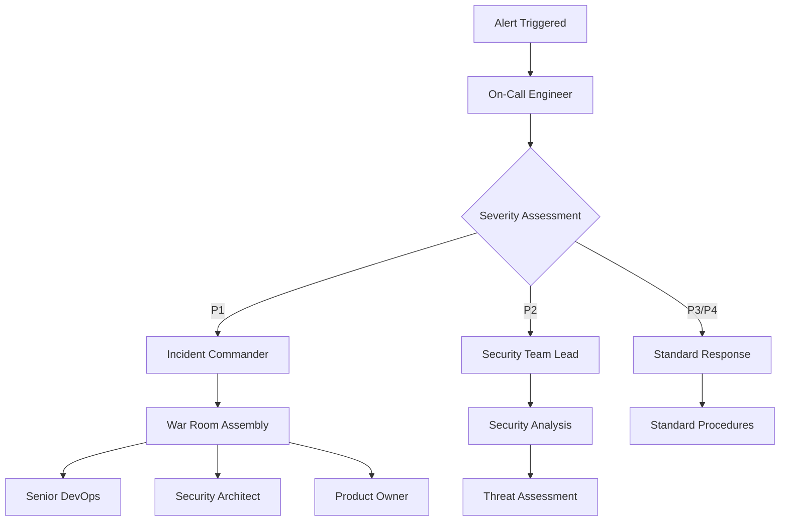

# FANZ Money Dash - Security Monitoring & Incident Response

## 🛡️ Security Monitoring Overview

The FANZ Money Dash application implements comprehensive security monitoring across multiple layers to ensure the highest level of protection for financial transactions and sensitive data.

### 📊 Monitoring Scope

#### Application Security
- **Authentication failures and anomalies**
- **Authorization bypass attempts**
- **Unusual transaction patterns**
- **API abuse and rate limit violations**
- **Input validation failures**
- **SQL injection attempts**
- **XSS attack attempts**
- **CSRF token violations**

#### Infrastructure Security
- **Container security vulnerabilities**
- **Network intrusion attempts**
- **Privilege escalation attempts**
- **File system integrity violations**
- **Unauthorized access attempts**
- **SSL/TLS certificate issues**
- **DNS spoofing attempts**

#### Data Security
- **Unauthorized data access attempts**
- **Data exfiltration patterns**
- **Encryption key compromise indicators**
- **Database security violations**
- **PII access anomalies**
- **Backup integrity issues**

## 🔍 Monitoring Tools & Services

### Primary Monitoring Stack

#### 1. Application Performance Monitoring (APM)
- **Service**: New Relic / DataDog / Dynatrace
- **Purpose**: Real-time application performance and security monitoring
- **Alerts**: Performance degradation, error spikes, security anomalies

#### 2. Log Management
- **Service**: ELK Stack (Elasticsearch, Logstash, Kibana) / Splunk
- **Purpose**: Centralized log collection, analysis, and alerting
- **Retention**: 90 days for security logs, 30 days for application logs

#### 3. Security Information and Event Management (SIEM)
- **Service**: Splunk Security / QRadar / Sumo Logic
- **Purpose**: Advanced threat detection and incident correlation
- **Features**: Behavioral analytics, threat intelligence integration

#### 4. Vulnerability Scanning
- **Service**: Qualys / Nessus / Rapid7
- **Schedule**: Weekly automated scans, monthly comprehensive assessments
- **Scope**: Web application, containers, infrastructure

#### 5. Network Monitoring
- **Service**: Wireshark / SolarWinds / PRTG
- **Purpose**: Network traffic analysis and intrusion detection
- **Coverage**: All network segments and endpoints

## 🚨 Alert Definitions & Thresholds

### Critical Alerts (P1 - Immediate Response)

#### Security Incidents
- **Authentication bypass detected**
- **Privilege escalation attempt**
- **Data exfiltration indicators**
- **Malware detection**
- **DDoS attack in progress**

```yaml
alert_rules:
  - name: "Authentication Bypass Detected"
    condition: "failed_auth_attempts > 10 AND success_rate < 10%"
    severity: "P1"
    notification: "immediate"
    escalation: "5 minutes"

  - name: "Unusual Transaction Pattern"
    condition: "transaction_volume > 1000% baseline OR transaction_amount > $50000"
    severity: "P1" 
    notification: "immediate"
    escalation: "3 minutes"

  - name: "Container Security Violation"
    condition: "container_privilege_escalation OR rootkit_detection"
    severity: "P1"
    notification: "immediate"
    escalation: "2 minutes"
```

### High Priority Alerts (P2 - Response within 15 minutes)

#### Application Security
- **High volume of failed authentication attempts**
- **Rate limiting triggers**
- **Suspicious API usage patterns**
- **Input validation failures spike**

```yaml
alert_rules:
  - name: "High Authentication Failures"
    condition: "failed_auth_attempts > 100 in 5 minutes"
    severity: "P2"
    notification: "15 minutes"
    escalation: "30 minutes"

  - name: "API Rate Limit Violations"
    condition: "rate_limit_violations > 50 in 10 minutes"
    severity: "P2"
    notification: "15 minutes"
    escalation: "30 minutes"
```

### Medium Priority Alerts (P3 - Response within 1 hour)

#### Infrastructure Security
- **SSL certificate expiration warnings**
- **Dependency vulnerabilities**
- **Performance degradation**
- **Log ingestion failures**

## 📈 Security Metrics & KPIs

### Security Health Dashboard

#### Authentication Metrics
- **Success rate**: Target > 98%
- **Failed attempts**: Threshold < 5% of total
- **Account lockouts**: Monitor for patterns
- **Session duration**: Baseline establishment

#### Transaction Security
- **Fraud detection rate**: Target < 0.1%
- **False positive rate**: Target < 2%
- **Transaction processing time**: Baseline < 500ms
- **Chargeback rate**: Target < 0.5%

#### Infrastructure Security
- **Vulnerability scan results**: Target 0 critical, < 5 high
- **Patch compliance**: Target > 95%
- **Security configuration compliance**: Target > 98%
- **Incident response time**: Target < 15 minutes for P1

## 🔄 Incident Response Procedures

### Incident Classification

#### Severity Levels
- **P1 (Critical)**: Service down, data breach, active attack
- **P2 (High)**: Significant functionality impaired, security compromise
- **P3 (Medium)**: Minor functionality affected, potential security issue
- **P4 (Low)**: Cosmetic issues, minor configuration problems

### Response Timeline

#### P1 Incidents (Critical)
1. **0-2 minutes**: Automated alerting to on-call engineer
2. **2-5 minutes**: Incident commander assigned
3. **5-15 minutes**: Initial assessment and containment
4. **15-30 minutes**: Root cause analysis begins
5. **30-60 minutes**: Resolution or escalation to senior team

#### Response Team Structure



### Incident Response Playbooks

#### 1. Authentication Bypass Detection

```yaml
playbook: "auth_bypass_response"
steps:
  1. immediate_actions:
     - Lock affected user accounts
     - Enable additional MFA requirements
     - Increase authentication logging
     - Alert security team

  2. investigation:
     - Review authentication logs (last 24 hours)
     - Check for IP address patterns
     - Analyze user agent strings
     - Correlate with other security events

  3. containment:
     - Implement IP blocking if pattern identified
     - Force password resets for affected accounts
     - Increase rate limiting thresholds
     - Monitor for lateral movement

  4. eradication:
     - Apply security patches if vulnerability found
     - Update authentication rules
     - Enhance monitoring rules
     - Conduct security training if needed

  5. recovery:
     - Gradually restore normal authentication policies
     - Monitor for recurring issues
     - Update incident documentation
     - Conduct post-incident review
```

#### 2. Data Exfiltration Response

```yaml
playbook: "data_exfiltration_response"
steps:
  1. immediate_actions:
     - Block suspicious IP addresses
     - Isolate affected systems
     - Preserve forensic evidence
     - Notify legal and compliance teams

  2. investigation:
     - Analyze network traffic logs
     - Review database access logs
     - Check file system integrity
     - Identify data accessed or compromised

  3. containment:
     - Implement network segmentation
     - Revoke compromised credentials
     - Deploy additional monitoring
     - Contact law enforcement if required

  4. legal_compliance:
     - Document evidence chain
     - Prepare regulatory notifications
     - Engage external forensics if needed
     - Coordinate with legal counsel

  5. customer_notification:
     - Prepare customer communications
     - Update privacy policy if needed
     - Provide credit monitoring if applicable
     - Document lessons learned
```

## 📋 Security Monitoring Checklist

### Daily Monitoring Tasks
- [ ] Review overnight security alerts
- [ ] Check authentication failure rates
- [ ] Monitor transaction anomalies
- [ ] Verify backup integrity
- [ ] Review system performance metrics
- [ ] Check SSL certificate status

### Weekly Monitoring Tasks
- [ ] Run vulnerability scans
- [ ] Review security patch status
- [ ] Analyze security trends
- [ ] Update threat intelligence feeds
- [ ] Test incident response procedures
- [ ] Review access controls

### Monthly Monitoring Tasks
- [ ] Comprehensive security assessment
- [ ] Review and update monitoring rules
- [ ] Conduct tabletop exercises
- [ ] Update incident response playbooks
- [ ] Security awareness training
- [ ] Compliance audit preparation

### Quarterly Monitoring Tasks
- [ ] Penetration testing
- [ ] Security architecture review
- [ ] Disaster recovery testing
- [ ] Security policy updates
- [ ] Third-party security assessments
- [ ] Executive security briefings

## 🔧 Monitoring Configuration

### Log Sources Configuration

#### Application Logs
```yaml
application_logs:
  sources:
    - path: "/var/log/fanz-money-dash/application.log"
      type: "application"
      format: "json"
      retention: "30 days"
    
    - path: "/var/log/fanz-money-dash/security.log"
      type: "security"
      format: "json"
      retention: "90 days"
    
    - path: "/var/log/fanz-money-dash/audit.log"
      type: "audit"
      format: "json"
      retention: "365 days"

  filters:
    - name: "authentication_events"
      pattern: "auth\\.(login|logout|failed)"
      priority: "high"
    
    - name: "transaction_events"
      pattern: "transaction\\.(create|update|delete)"
      priority: "high"
    
    - name: "security_events"
      pattern: "security\\.(violation|alert|threat)"
      priority: "critical"
```

#### System Logs
```yaml
system_logs:
  sources:
    - path: "/var/log/syslog"
      type: "system"
      format: "syslog"
    
    - path: "/var/log/auth.log"
      type: "authentication"
      format: "syslog"
    
    - path: "/var/log/nginx/access.log"
      type: "web_access"
      format: "nginx"
    
    - path: "/var/log/nginx/error.log"
      type: "web_error"
      format: "nginx"
```

### Alert Routing Configuration

```yaml
alert_routing:
  channels:
    slack:
      webhook_url: "${SLACK_SECURITY_WEBHOOK_URL}"
      channel: "#security-alerts"
      username: "SecurityBot"
    
    email:
      smtp_server: "smtp.fanz.network"
      recipients:
        - "security-team@fanz.network"
        - "devops-team@fanz.network"
    
    pagerduty:
      service_key: "${PAGERDUTY_SERVICE_KEY}"
      escalation_policy: "security-escalation"
    
    webhook:
      url: "${SECURITY_WEBHOOK_URL}"
      method: "POST"
      headers:
        authorization: "Bearer ${SECURITY_API_TOKEN}"

  routing_rules:
    - severity: "P1"
      channels: ["slack", "email", "pagerduty"]
      immediate: true
    
    - severity: "P2"
      channels: ["slack", "email"]
      delay: "15 minutes"
    
    - severity: "P3"
      channels: ["slack"]
      delay: "1 hour"
    
    - severity: "P4"
      channels: ["slack"]
      delay: "24 hours"
```

## 📞 Emergency Contacts

### Security Team
- **Security Team Lead**: security-lead@fanz.network
- **Incident Commander**: incident-commander@fanz.network
- **DevOps Lead**: devops-lead@fanz.network

### External Contacts
- **Legal Counsel**: legal@fanz.network
- **Compliance Officer**: compliance@fanz.network
- **External Security Consultant**: security-consultant@example.com

### Emergency Numbers
- **Security Hotline**: +1-555-SECURITY (555-732-8748)
- **Incident Response**: +1-555-INCIDENT (555-462-4336)

## 📚 Additional Resources

### Documentation
- [Security Policies](./SECURITY_POLICIES.md)
- [Incident Response Plan](./INCIDENT_RESPONSE.md)
- [Disaster Recovery Plan](./DISASTER_RECOVERY.md)
- [Compliance Documentation](./COMPLIANCE.md)

### Training Materials
- Security Awareness Training
- Incident Response Training
- Forensics Procedures
- Legal and Compliance Requirements

### Tools and Dashboards
- [Security Dashboard](https://security.fanz.network)
- [Incident Management](https://incidents.fanz.network)
- [Vulnerability Scanner](https://vulns.fanz.network)
- [Log Analysis](https://logs.fanz.network)

---

**Document Version**: 1.0  
**Last Updated**: December 2024  
**Next Review**: March 2025  
**Owner**: Security Team  
**Classification**: Internal Use